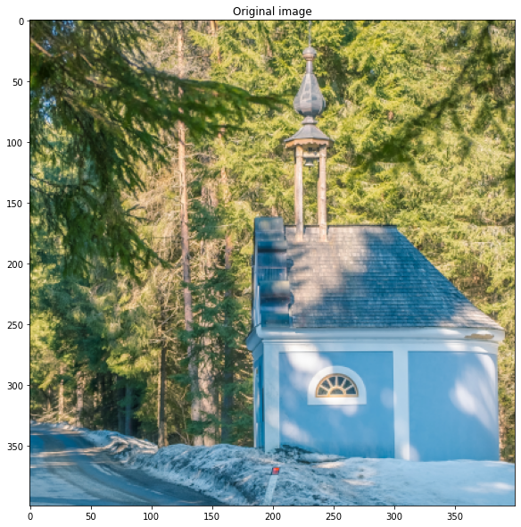
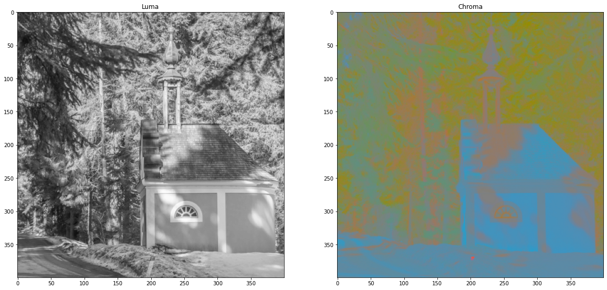
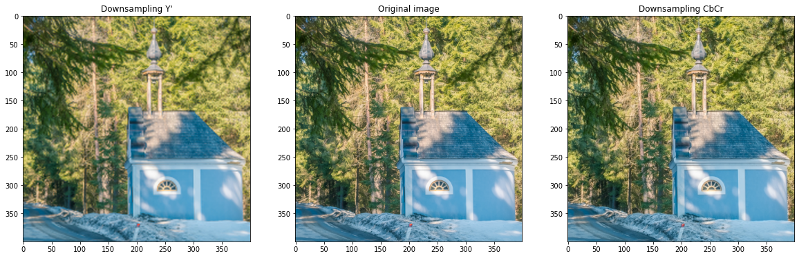
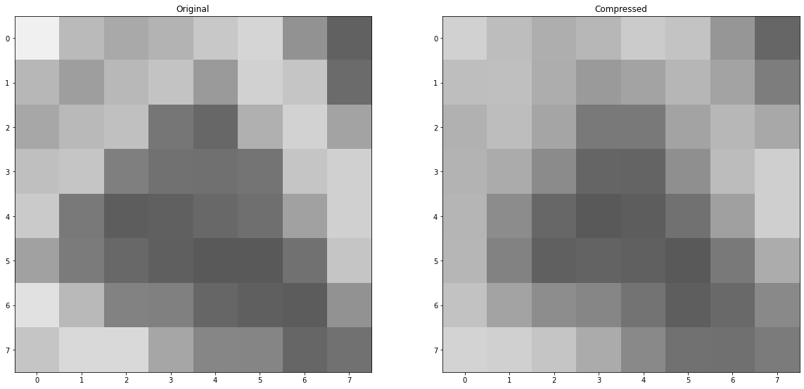
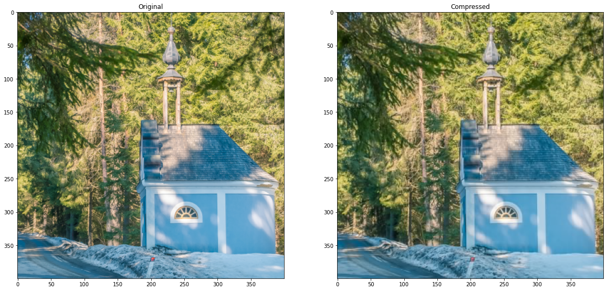

# The JPEG compression

*Author: Alban Fichet <alban.fichet@gmx.fr>*  
*License: BSD 3-Clause License https://opensource.org/licenses/BSD-3-Clause*  
*Last modified: Oct. 18th 2021*  
*This code is for educational purpose, not meant to be efficient or clever.*

## Introduction
The JPEG (the Joint Photographic Experts Group) version 1 is a widely used image compression method for pictures. This notebook explains how it works and the different steps of the compression algorithm.

This lossy compression scheme exploits the weakness of human vision to preserve only the most relevant information in a picture. It is mainly based on those two assumptions:

- We are more sensitive to luminance variation than to colour variation
- We are less sensitive to high frequencies than lower frequencies


```python
import numpy as np
import scipy.fftpack
from PIL import Image
import matplotlib.pyplot as plt
from IPython.display import display, Markdown, Latex, HTML
import scipy.ndimage

plt.rcParams['figure.figsize'] = (20.0, 10.0)
plt.rcParams['figure.facecolor'] = 'white'

# Helper functions to nicely display a matrix

def display_matrix(m):
    prt = '<table style="background:white; boder-style:solid; border:1px">'
    for i in range(m.shape[0]):
        prt += ' <tr>'
        for j in range(m.shape[1]):
            prt += '  <td>{}</td>'.format(m[i, j])
        prt += ' </tr>'
    prt += '</table>'
    display(HTML(prt))
    
    
def display_matrix_float(m):
    prt = '<table style="background:white; boder-style:solid; border:1px">'
    for i in range(m.shape[0]):
        prt += ' <tr>'
        for j in range(m.shape[1]):
            prt += '  <td>{0:.2f}</td>'.format(m[i, j])
        prt += ' </tr>'
    prt += '</table>'
    display(HTML(prt))
```

We load our original image:


```python
img = Image.open('sample.png')
image = np.asarray(img)

plt.title('Original image')
plt.imshow(image)
plt.show()
```


    

    


# Compression


## Sepration of Luma Y' and Chroma CbCr

The separation of luma and chroma channels are based on Rec. 601. Chroma channel are translated to use the full unsigned 8bit range $[0; 255]$

$$
\begin{align}
 Y' &=&    &0.299    & \cdot R' &+ &0.587    & \cdot G' &+ &0.114  & \cdot B'\\
 C_B &=& - &0.168736 & \cdot R' &- &0.331264 & \cdot G' &+ &0.5   & \cdot B' &+ 128\\
 C_R &=&   &0.5      & \cdot R' &- &0.418688 & \cdot G' &- &0.081312 & \cdot B' &+ 128
\end{align}
$$


```python
def rgb_to_ycbcr_jpeg(rgb):
    y  =  0.299    * rgb[0] + 0.587    * rgb[1] + 0.114    * rgb[2]
    cb = -0.168736 * rgb[0] - 0.331264 * rgb[1] + 0.5      * rgb[2] + 128
    cr =  0.5      * rgb[0] - 0.418688 * rgb[1] - 0.081312 * rgb[2] + 128
    
    return [int(min(max(y, 0), 255)), int(min(max(cb, 0), 255)), int(min(max(cr, 0), 255))]


def image_rgb_to_ycbcr_jpeg(image):
    image_r, image_g, image_b = image[:,:,0], image[:,:,1], image[:,:,2]
    
    image_y  = np.clip(0.299    * image_r + 0.587    * image_g + 0.114    * image_b, 0, 255)
    image_cb = np.clip(-0.168736* image_r - 0.331264 * image_g + 0.5      * image_b + 128, 0, 255)
    image_cr = np.clip(0.5      * image_r - 0.418688 * image_g - 0.081312 * image_b + 128, 0, 255)
    
    return np.array(np.dstack((image_y, image_cb, image_cr)), dtype=np.uint8)


# Will be described later...
def ycbcr_to_rgb_jpeg(ycbcr):
    r = ycbcr[0]                               + 1.402    * (ycbcr[2] - 128)
    g = ycbcr[0] - 0.344136 * (ycbcr[1] - 128) - 0.714136 * (ycbcr[2] - 128)
    b = ycbcr[0] + 1.772    * (ycbcr[1] - 128)
    
    return [int(min(max(r, 0), 255)), int(min(max(g, 0), 255)), int(min(max(b, 0), 255))]


def image_ycbcr_to_rgb_jpeg(image):
    image_y, image_cb, image_cr = image[:,:,0], image[:,:,1], image[:,:,2]
    
    
    image_r = np.clip(image_y                               + 1.402    * (image_cr - 128), 0, 255)
    image_g = np.clip(image_y - 0.344136 * (image_cb - 128) - 0.714136 * (image_cr - 128), 0, 255)
    image_b = np.clip(image_y + 1.772    * (image_cb - 128)                              , 0, 255)
    
    return np.array(np.dstack((image_r, image_g, image_b)), dtype=np.uint8)
```

__Example__:

We separate the original RGB image into one Y' (luma) image (black and white) and one two channels CbCr (chroma) image. The two images are going to follow the same pipeline but with different parameters.


```python
disp_cbcr = np.zeros((*image.shape[0:2], 3), dtype=np.int32)

image_ycbcr = image_rgb_to_ycbcr_jpeg(image)


# Just to display the chroma channel
disp_cbcr = image_ycbcr_to_rgb_jpeg(
    np.dstack((128 * np.ones(image.shape[0:2]),
               image_ycbcr[:, :, 1],
               image_ycbcr[:, :, 2])
             )
)

plt.subplot(121)
plt.title('Luma')
plt.imshow(image_ycbcr[:,:, 0], cmap='gray', vmin=0, vmax=255)

plt.subplot(122)
plt.title('Chroma')
plt.imshow(disp_cbcr)
plt.show()
```


    

    


## Lossy step: downsampling chroma

The chroma is less perceptually important than the luma. JPEG exploits this fact by reducing the resolution of the chroma channels while keeping the original resolution of the luma.


```python
from skimage.measure import block_reduce

# Downsample each channel (Y is just for demo)
image_degraded_y  = block_reduce(image_ycbcr[:, :, 0], block_size=(2, 2), func=np.mean)
image_degraded_cb = block_reduce(image_ycbcr[:, :, 1], block_size=(2, 2), func=np.mean)
image_degraded_cr = block_reduce(image_ycbcr[:, :, 2], block_size=(2, 2), func=np.mean)

# Rescale
display_degraded_y  = scipy.ndimage.zoom(image_degraded_y , 2)
display_degraded_cb = scipy.ndimage.zoom(image_degraded_cb, 2)
display_degraded_cr = scipy.ndimage.zoom(image_degraded_cr, 2)

disp_degraded_y    = image_ycbcr_to_rgb_jpeg(
    np.dstack((display_degraded_y,
               image_ycbcr[:, :, 1],
               image_ycbcr[:, :, 2])
             )
)

disp_degraded_cbcr = image_ycbcr_to_rgb_jpeg(
    np.dstack((image_ycbcr[:, :, 0],
               display_degraded_cb,
               display_degraded_cr)
             )
)
        
plt.subplot(131)
plt.title('Downsampling Y\'')
plt.imshow(disp_degraded_y)

plt.subplot(132)
plt.title('Original image')
plt.imshow(image)

plt.subplot(133)
plt.title('Downsampling CbCr')
plt.imshow(disp_degraded_cbcr)
plt.show()
```


    

    


## Frequency separation (Discrete Cosine Transform - DCT)

After this step, the image is processed on each 8x8 image block. The process is the same for the luma and the chroma channels. Only the quantization matrices (see below) change between luma and chroma.

So, let's consider the first 8 by 8 image block:


```python
x, y = 240, 295
luma_block = image_ycbcr[y:y+8, x:x+8, 0]

display(Markdown('Original image block'))
display_matrix(luma_block)

# plt.imshow(luma_block, cmap='gray', vmin=0, vmax=255)
# plt.show()
```


Original image block


<table style="background:white; boder-style:solid; border:1px"> <tr>  <td>240</td>  <td>186</td>  <td>169</td>  <td>180</td>  <td>200</td>  <td>213</td>  <td>146</td>  <td>97</td> </tr> <tr>  <td>183</td>  <td>158</td>  <td>184</td>  <td>196</td>  <td>154</td>  <td>209</td>  <td>197</td>  <td>107</td> </tr> <tr>  <td>167</td>  <td>185</td>  <td>192</td>  <td>118</td>  <td>103</td>  <td>176</td>  <td>210</td>  <td>163</td> </tr> <tr>  <td>191</td>  <td>197</td>  <td>127</td>  <td>114</td>  <td>112</td>  <td>116</td>  <td>197</td>  <td>208</td> </tr> <tr>  <td>202</td>  <td>121</td>  <td>93</td>  <td>96</td>  <td>104</td>  <td>111</td>  <td>161</td>  <td>208</td> </tr> <tr>  <td>161</td>  <td>123</td>  <td>104</td>  <td>95</td>  <td>90</td>  <td>89</td>  <td>113</td>  <td>197</td> </tr> <tr>  <td>225</td>  <td>185</td>  <td>130</td>  <td>128</td>  <td>102</td>  <td>95</td>  <td>92</td>  <td>146</td> </tr> <tr>  <td>197</td>  <td>217</td>  <td>217</td>  <td>166</td>  <td>134</td>  <td>133</td>  <td>102</td>  <td>113</td> </tr></table>


To center values at 0 we subtract -128 to each of the pixel values.


```python
shifted_luma_block = luma_block - 128*np.ones((8, 8), dtype=np.int8)

display(Markdown('Shifted image block'))
display_matrix(shifted_luma_block)
```


Shifted image block


<table style="background:white; boder-style:solid; border:1px"> <tr>  <td>112</td>  <td>58</td>  <td>41</td>  <td>52</td>  <td>72</td>  <td>85</td>  <td>18</td>  <td>-31</td> </tr> <tr>  <td>55</td>  <td>30</td>  <td>56</td>  <td>68</td>  <td>26</td>  <td>81</td>  <td>69</td>  <td>-21</td> </tr> <tr>  <td>39</td>  <td>57</td>  <td>64</td>  <td>-10</td>  <td>-25</td>  <td>48</td>  <td>82</td>  <td>35</td> </tr> <tr>  <td>63</td>  <td>69</td>  <td>-1</td>  <td>-14</td>  <td>-16</td>  <td>-12</td>  <td>69</td>  <td>80</td> </tr> <tr>  <td>74</td>  <td>-7</td>  <td>-35</td>  <td>-32</td>  <td>-24</td>  <td>-17</td>  <td>33</td>  <td>80</td> </tr> <tr>  <td>33</td>  <td>-5</td>  <td>-24</td>  <td>-33</td>  <td>-38</td>  <td>-39</td>  <td>-15</td>  <td>69</td> </tr> <tr>  <td>97</td>  <td>57</td>  <td>2</td>  <td>0</td>  <td>-26</td>  <td>-33</td>  <td>-36</td>  <td>18</td> </tr> <tr>  <td>69</td>  <td>89</td>  <td>89</td>  <td>38</td>  <td>6</td>  <td>5</td>  <td>-26</td>  <td>-15</td> </tr></table>


We perform a Discrete Cosine Transform (DCT):

$$
F(u, v) = \frac{1}{4} \cdot C(u) \cdot C(v) \left[ 
    \sum_{x=0}^{7} \sum_{y=0}^{7} 
        f(x, y) \cdot 
        \cos \frac{(2x + 1)u\pi}{16} \cdot
        \cos \frac{(2y + 1)v\pi}{16}
    \right]
$$


```python
# Detailed implementation (not optimized and slow:

def dct2(img):
    img_dct = np.zeros(img.shape)
    
    for u in range(8):
        C_u = 1 if u > 0 else 1/np.sqrt(2)
        
        for v in range(8):
            C_v = 1 if v > 0 else 1/np.sqrt(2)
            
            for x in range(8):
                for y in range(8):
                    img_dct[v, u] += (
                        img[y, x] * 
                        np.cos((2*x + 1) * u * np.pi / 16) * 
                        np.cos((2*y + 1) * v * np.pi / 16)
                    )
                    
            img_dct[v, u] *= C_u * C_v / 4
            
    return img_dct


# Using Scipy built-in functions, much more efficient
# from: https://inst.eecs.berkeley.edu/~ee123/sp16/Sections/JPEG_DCT_Demo.html

def dct2(a):
    return scipy.fftpack.dct( 
        scipy.fftpack.dct(a, axis=0, norm='ortho'), 
        axis=1, norm='ortho')
```

Now, we perform the Discrete Cosine Transform on the shifted pixel values:


```python
dct_luma_block = dct2(shifted_luma_block)

display(Markdown('Discrete Fourier Transform'))
display_matrix_float(dct_luma_block)
```


Discrete Fourier Transform


<table style="background:white; boder-style:solid; border:1px"> <tr>  <td>206.63</td>  <td>89.84</td>  <td>132.14</td>  <td>20.69</td>  <td>-6.38</td>  <td>21.78</td>  <td>10.34</td>  <td>-9.27</td> </tr> <tr>  <td>107.56</td>  <td>-47.00</td>  <td>-68.92</td>  <td>70.88</td>  <td>-56.38</td>  <td>43.75</td>  <td>-4.70</td>  <td>2.99</td> </tr> <tr>  <td>71.36</td>  <td>123.74</td>  <td>-135.99</td>  <td>39.27</td>  <td>-21.42</td>  <td>0.37</td>  <td>26.97</td>  <td>-15.16</td> </tr> <tr>  <td>-63.09</td>  <td>-19.58</td>  <td>15.91</td>  <td>40.62</td>  <td>86.13</td>  <td>-9.98</td>  <td>12.84</td>  <td>-3.90</td> </tr> <tr>  <td>36.38</td>  <td>21.60</td>  <td>2.21</td>  <td>18.73</td>  <td>20.37</td>  <td>-17.55</td>  <td>-11.33</td>  <td>8.37</td> </tr> <tr>  <td>1.71</td>  <td>32.17</td>  <td>41.69</td>  <td>3.39</td>  <td>10.75</td>  <td>-29.78</td>  <td>-19.34</td>  <td>-3.27</td> </tr> <tr>  <td>-9.67</td>  <td>-13.28</td>  <td>-0.28</td>  <td>-20.52</td>  <td>-25.90</td>  <td>-19.34</td>  <td>17.99</td>  <td>11.69</td> </tr> <tr>  <td>-1.26</td>  <td>8.35</td>  <td>15.80</td>  <td>19.94</td>  <td>-1.87</td>  <td>5.10</td>  <td>16.99</td>  <td>5.16</td> </tr></table>


## Lossy step: quantization

The JPEG proposes two "standard" quantization tables, one for luma and the other for chroma. Note that some manufacturers use different quantization tables, sometimes computed on the fly on a per image basis. This discrepancy of quantization tables is used to detect edited photographs sometimes.

We are using the two proposed quantization tables from JPEG. You can find additional tables here: https://impulseadventure.com/photo/jpeg-quantization.html.

A quality parameter $Q \in ]0; 100]$ scales the quantization tables. This quality parameter defines a scaling factor:

$$
S = 
    \begin{cases}
        \frac{500}{Q} & \text{if } Q < 50 \\
        200 - 2\cdot Q & \text{otherwise}
    \end{cases}
$$

This scaling factor modifies the base quantization tables $T_b$ (either luma or chroma base table):

$$
T_s[i] = \left\lfloor\frac{S\cdot T_b[i] + 50}{100} \right\rfloor
$$

In the final quantization table, the higher a number is, the lower the quality will be: the image is divided by each coefficient of the quantization table and will have more chance to round to 0 with an higher values in the quantization table.


```python
# JPEG standard base quantization tables

base_quantization_luma = np.array(
    [
        [16, 11, 10, 16, 24, 40, 51, 61],
        [12, 12, 14, 19, 26, 58, 60, 55],
        [14, 13, 16, 24, 40, 57, 69, 56],
        [14, 17, 22, 29, 51, 87, 80, 62],
        [18, 22, 37, 56, 68, 109, 103, 77],
        [24, 35, 55, 64, 81, 104, 113, 92],
        [49, 64, 78, 87, 103, 121, 120, 101],
        [72, 92, 95, 98, 112, 100, 103, 99]
    ])

base_quantization_chroma = np.array(
    [
        [17, 18, 24, 47, 99, 99, 99, 99],
        [18, 21, 26, 66, 99, 99, 99, 99],
        [24, 26, 56, 99, 99, 99, 99, 99],
        [47, 66, 99, 99, 99, 99, 99, 99],
        [99, 99, 99, 99, 99, 99, 99, 99],
        [99, 99, 99, 99, 99, 99, 99, 99],
        [99, 99, 99, 99, 99, 99, 99, 99],
        [99, 99, 99, 99, 99, 99, 99, 99]
    ])


# Scaling function
def get_scaling(quality):
    if quality < 50:
        return 500 / quality
    else:
        return 200 - 2 * quality
    

# Derived quantization tables based on quality parameter

def get_quantization_table_luma(quality):
    return np.array(np.floor((base_quantization_luma * get_scaling(quality) + 50) / 100),
                    dtype=np.uint8)


def get_quantization_table_chroma(quality):
    return np.array(np.floor((base_quantization_chroma * get_scaling(quality) + 50) / 100), 
                    dtype=np.uint8)
```


```python
quality = 50

quantization_luma   = get_quantization_table_luma(quality)
quantization_chroma = get_quantization_table_chroma(quality)

display(Markdown('Luma quantization table'))
display_matrix(quantization_luma)

display(Markdown('Chroma quantization table'))
display_matrix(quantization_chroma)
```


Luma quantization table


<table style="background:white; boder-style:solid; border:1px"> <tr>  <td>16</td>  <td>11</td>  <td>10</td>  <td>16</td>  <td>24</td>  <td>40</td>  <td>51</td>  <td>61</td> </tr> <tr>  <td>12</td>  <td>12</td>  <td>14</td>  <td>19</td>  <td>26</td>  <td>58</td>  <td>60</td>  <td>55</td> </tr> <tr>  <td>14</td>  <td>13</td>  <td>16</td>  <td>24</td>  <td>40</td>  <td>57</td>  <td>69</td>  <td>56</td> </tr> <tr>  <td>14</td>  <td>17</td>  <td>22</td>  <td>29</td>  <td>51</td>  <td>87</td>  <td>80</td>  <td>62</td> </tr> <tr>  <td>18</td>  <td>22</td>  <td>37</td>  <td>56</td>  <td>68</td>  <td>109</td>  <td>103</td>  <td>77</td> </tr> <tr>  <td>24</td>  <td>35</td>  <td>55</td>  <td>64</td>  <td>81</td>  <td>104</td>  <td>113</td>  <td>92</td> </tr> <tr>  <td>49</td>  <td>64</td>  <td>78</td>  <td>87</td>  <td>103</td>  <td>121</td>  <td>120</td>  <td>101</td> </tr> <tr>  <td>72</td>  <td>92</td>  <td>95</td>  <td>98</td>  <td>112</td>  <td>100</td>  <td>103</td>  <td>99</td> </tr></table>


Chroma quantization table


<table style="background:white; boder-style:solid; border:1px"> <tr>  <td>17</td>  <td>18</td>  <td>24</td>  <td>47</td>  <td>99</td>  <td>99</td>  <td>99</td>  <td>99</td> </tr> <tr>  <td>18</td>  <td>21</td>  <td>26</td>  <td>66</td>  <td>99</td>  <td>99</td>  <td>99</td>  <td>99</td> </tr> <tr>  <td>24</td>  <td>26</td>  <td>56</td>  <td>99</td>  <td>99</td>  <td>99</td>  <td>99</td>  <td>99</td> </tr> <tr>  <td>47</td>  <td>66</td>  <td>99</td>  <td>99</td>  <td>99</td>  <td>99</td>  <td>99</td>  <td>99</td> </tr> <tr>  <td>99</td>  <td>99</td>  <td>99</td>  <td>99</td>  <td>99</td>  <td>99</td>  <td>99</td>  <td>99</td> </tr> <tr>  <td>99</td>  <td>99</td>  <td>99</td>  <td>99</td>  <td>99</td>  <td>99</td>  <td>99</td>  <td>99</td> </tr> <tr>  <td>99</td>  <td>99</td>  <td>99</td>  <td>99</td>  <td>99</td>  <td>99</td>  <td>99</td>  <td>99</td> </tr> <tr>  <td>99</td>  <td>99</td>  <td>99</td>  <td>99</td>  <td>99</td>  <td>99</td>  <td>99</td>  <td>99</td> </tr></table>


We use the quantization table to divide the DCT coefficients. Depending on each quantization value, this will reduce the resolution of the DCT coefficients. 

After this stage, many of the high frequency values are set to zero.


```python
quantized_luma_block = np.array(dct_luma_block / quantization_luma, dtype=np.int16)

display(Markdown('Quantitized luma'))
display_matrix(quantized_luma_block)
```


Quantitized luma


<table style="background:white; boder-style:solid; border:1px"> <tr>  <td>12</td>  <td>8</td>  <td>13</td>  <td>1</td>  <td>0</td>  <td>0</td>  <td>0</td>  <td>0</td> </tr> <tr>  <td>8</td>  <td>-3</td>  <td>-4</td>  <td>3</td>  <td>-2</td>  <td>0</td>  <td>0</td>  <td>0</td> </tr> <tr>  <td>5</td>  <td>9</td>  <td>-8</td>  <td>1</td>  <td>0</td>  <td>0</td>  <td>0</td>  <td>0</td> </tr> <tr>  <td>-4</td>  <td>-1</td>  <td>0</td>  <td>1</td>  <td>1</td>  <td>0</td>  <td>0</td>  <td>0</td> </tr> <tr>  <td>2</td>  <td>0</td>  <td>0</td>  <td>0</td>  <td>0</td>  <td>0</td>  <td>0</td>  <td>0</td> </tr> <tr>  <td>0</td>  <td>0</td>  <td>0</td>  <td>0</td>  <td>0</td>  <td>0</td>  <td>0</td>  <td>0</td> </tr> <tr>  <td>0</td>  <td>0</td>  <td>0</td>  <td>0</td>  <td>0</td>  <td>0</td>  <td>0</td>  <td>0</td> </tr> <tr>  <td>0</td>  <td>0</td>  <td>0</td>  <td>0</td>  <td>0</td>  <td>0</td>  <td>0</td>  <td>0</td> </tr></table>


## Entropy encoding

After the quantization step, we organize the data in a zigzag fashion. This sorts frequencies from low to high. Since higher frequencies are more likely to round to a 0 value after the quantization step, successive 0s are later efficiently compressed by *Run Length Encoding* (RLE).


```python
for i in range(16):
    if i % 2 == 0:
        p = min(i, 7)
        q = i - p
    else:
        q = min(i, 7)
        p = i - q
    while p >= 0 and q >= 0 and p < 8 and q < 8:
        print('B[{},{}]'.format(p, q), end=' ')
        if i % 2 == 0:
            p -= 1
            q += 1
        else:
            p += 1
            q -= 1
            
    print()
```

    B[0,0] 
    B[0,1] B[1,0] 
    B[2,0] B[1,1] B[0,2] 
    B[0,3] B[1,2] B[2,1] B[3,0] 
    B[4,0] B[3,1] B[2,2] B[1,3] B[0,4] 
    B[0,5] B[1,4] B[2,3] B[3,2] B[4,1] B[5,0] 
    B[6,0] B[5,1] B[4,2] B[3,3] B[2,4] B[1,5] B[0,6] 
    B[0,7] B[1,6] B[2,5] B[3,4] B[4,3] B[5,2] B[6,1] B[7,0] 
    B[7,1] B[6,2] B[5,3] B[4,4] B[3,5] B[2,6] B[1,7] 
    B[2,7] B[3,6] B[4,5] B[5,4] B[6,3] B[7,2] 
    B[7,3] B[6,4] B[5,5] B[4,6] B[3,7] 
    B[4,7] B[5,6] B[6,5] B[7,4] 
    B[7,5] B[6,6] B[5,7] 
    B[6,7] B[7,6] 
    B[7,7] 
    


```python
def zigzag_jpeg(mat):
    ret_val = []
    
    for i in range(16):
        if i % 2 == 0:
            p = min(i, 7)
            q = i - p
        else:
            q = min(i, 7)
            p = i - q
        while p >= 0 and q >= 0 and p < 8 and q < 8:
            ret_val.append(mat[p, q])
            
            if i % 2 == 0:
                p -= 1
                q += 1
            else:
                p += 1
                q -= 1
                
    return ret_val

zigzag_luma = zigzag_jpeg(quantized_luma_block)

print(zigzag_luma)
```

    [12, 8, 8, 5, -3, 13, 1, -4, 9, -4, 2, -1, -8, 3, 0, 0, -2, 1, 0, 0, 0, 0, 0, 0, 1, 0, 0, 0, 0, 0, 0, 1, 0, 0, 0, 0, 0, 0, 0, 0, 0, 0, 0, 0, 0, 0, 0, 0, 0, 0, 0, 0, 0, 0, 0, 0, 0, 0, 0, 0, 0, 0, 0, 0]


### Run Length Encoding compression

The zigzag organized data is compressed using *Run Length Encoding* (RLE) for AC elements (all but the first element `B[0, 0]`). We store each element with the number of 0s before it: `(n_zeros_before, value)`. If there is only zeros remaining in the list, we place the terminating element `(0, 0)` early to end the sequence. 


```python
def compress_runlength_jpeg(l):
    n_zeros = 0
    ret_val = [l[0]]
    
    for el in l[1:]:
        if el == 0:
            n_zeros += 1
        else:
            ret_val.append((n_zeros, el))
            n_zeros = 0
    ret_val.append((0, 0))
    
    return ret_val
```


```python
runlength_luma = compress_runlength_jpeg(zigzag_luma)

print(runlength_luma)
```

    [12, (0, 8), (0, 8), (0, 5), (0, -3), (0, 13), (0, 1), (0, -4), (0, 9), (0, -4), (0, 2), (0, -1), (0, -8), (0, 3), (2, -2), (0, 1), (6, 1), (6, 1), (0, 0)]


### Huffman coding

**This step is not implemented yet!**

To further compress the bitstream, Huffman coding is used.
We are not providing the method here. You can find more info there: https://impulseadventure.com/photo/jpeg-huffman-coding.html


```python

```

# Decompression

To decompress the image, all previous steps are done in reverse.

## Entropy decoding

### Huffman decoding

**This step is not implemented yet!**

See: https://impulseadventure.com/photo/jpeg-huffman-coding.html


```python

```

### RLE decompression

Since the length of the sequence is variable for an 8x8 block, we also need to return the first index of the next sequence.


```python
def uncompress_runlength_jpeg(l):
    ret_val = [l[0]]
    n_el = 1
    idx_next_frame = 1
    
    for n_zeros, el in l[1:]:
        if n_zeros == 0 and el == 0:
            # Termination of the sequence, fill remaining values with 0
            ret_val += (64 - n_el) * [0]
            break
        else:
            # Append the number of zeros
            ret_val += n_zeros * [0]
            ret_val.append(el)
            n_el += n_zeros + 1
            idx_next_frame += 1
    
    return ret_val, idx_next_frame + 1
```


```python
zigzag_luma_un, next_frame_luma = uncompress_runlength_jpeg(runlength_luma[0:])

print(zigzag_luma_un)
```

    [12, 8, 8, 5, -3, 13, 1, -4, 9, -4, 2, -1, -8, 3, 0, 0, -2, 1, 0, 0, 0, 0, 0, 0, 1, 0, 0, 0, 0, 0, 0, 1, 0, 0, 0, 0, 0, 0, 0, 0, 0, 0, 0, 0, 0, 0, 0, 0, 0, 0, 0, 0, 0, 0, 0, 0, 0, 0, 0, 0, 0, 0, 0, 0]


### Restoring 8x8 blocks from zigzag represented elements


```python
def unzigzag_jpeg(l):
    ret_val = np.zeros((8, 8), dtype=np.int16)
    
    idx = 0
    
    for i in range(16):
        if i % 2 == 0:
            p = min(i, 7)
            q = i - p
        else:
            q = min(i, 7)
            p = i - q
        while p >= 0 and q >= 0 and p < 8 and q < 8:
            ret_val[p, q] = l[idx]
            idx += 1
            
            if i % 2 == 0:
                p -= 1
                q += 1
            else:
                p += 1
                q -= 1
                
    return ret_val
```


```python
quantized_luma_block_un = unzigzag_jpeg(zigzag_luma_un)

display_matrix(quantized_luma_block_un)
```


<table style="background:white; boder-style:solid; border:1px"> <tr>  <td>12</td>  <td>8</td>  <td>13</td>  <td>1</td>  <td>0</td>  <td>0</td>  <td>0</td>  <td>0</td> </tr> <tr>  <td>8</td>  <td>-3</td>  <td>-4</td>  <td>3</td>  <td>-2</td>  <td>0</td>  <td>0</td>  <td>0</td> </tr> <tr>  <td>5</td>  <td>9</td>  <td>-8</td>  <td>1</td>  <td>0</td>  <td>0</td>  <td>0</td>  <td>0</td> </tr> <tr>  <td>-4</td>  <td>-1</td>  <td>0</td>  <td>1</td>  <td>1</td>  <td>0</td>  <td>0</td>  <td>0</td> </tr> <tr>  <td>2</td>  <td>0</td>  <td>0</td>  <td>0</td>  <td>0</td>  <td>0</td>  <td>0</td>  <td>0</td> </tr> <tr>  <td>0</td>  <td>0</td>  <td>0</td>  <td>0</td>  <td>0</td>  <td>0</td>  <td>0</td>  <td>0</td> </tr> <tr>  <td>0</td>  <td>0</td>  <td>0</td>  <td>0</td>  <td>0</td>  <td>0</td>  <td>0</td>  <td>0</td> </tr> <tr>  <td>0</td>  <td>0</td>  <td>0</td>  <td>0</td>  <td>0</td>  <td>0</td>  <td>0</td>  <td>0</td> </tr></table>


## Reversing the quantization

we can revert the quantization step knowing which quantization matrix is used. The quantization matrix is provided in the JFIF file. 

Due to rounding errors and aliasing, the reconstructed block won't be exactly the same as the original one (lossy compression).


```python
dct_luma_block_un = quantized_luma_block_un * quantization_luma

display_matrix(dct_luma_block_un)
```


<table style="background:white; boder-style:solid; border:1px"> <tr>  <td>192</td>  <td>88</td>  <td>130</td>  <td>16</td>  <td>0</td>  <td>0</td>  <td>0</td>  <td>0</td> </tr> <tr>  <td>96</td>  <td>-36</td>  <td>-56</td>  <td>57</td>  <td>-52</td>  <td>0</td>  <td>0</td>  <td>0</td> </tr> <tr>  <td>70</td>  <td>117</td>  <td>-128</td>  <td>24</td>  <td>0</td>  <td>0</td>  <td>0</td>  <td>0</td> </tr> <tr>  <td>-56</td>  <td>-17</td>  <td>0</td>  <td>29</td>  <td>51</td>  <td>0</td>  <td>0</td>  <td>0</td> </tr> <tr>  <td>36</td>  <td>0</td>  <td>0</td>  <td>0</td>  <td>0</td>  <td>0</td>  <td>0</td>  <td>0</td> </tr> <tr>  <td>0</td>  <td>0</td>  <td>0</td>  <td>0</td>  <td>0</td>  <td>0</td>  <td>0</td>  <td>0</td> </tr> <tr>  <td>0</td>  <td>0</td>  <td>0</td>  <td>0</td>  <td>0</td>  <td>0</td>  <td>0</td>  <td>0</td> </tr> <tr>  <td>0</td>  <td>0</td>  <td>0</td>  <td>0</td>  <td>0</td>  <td>0</td>  <td>0</td>  <td>0</td> </tr></table>


## Inversing the Discrete Cosine Transform

We perform the inverse DCT:

$$
f(x, y) = \frac{1}{4}\left[
    \sum_{u=0}^{7}\sum_{v=0}^{7}
        C(u) \cdot C(v) \cdot F(u, v) \cdot
        \cos \frac{(2x + 1)u\pi}{16} \cdot
        \cos \frac{(2y + 1)v\pi}{16}
    \right]
$$


```python
# Detailed implementation (not optimized and slow!):

def idct2(img_dct):
    img = np.zeros(img_dct.shape)
    
    for x in range(8):            
        for y in range(8):
            for u in range(8):
                C_u = 1 if u > 0 else 1/np.sqrt(2)
                for v in range(8):
                    C_v = 1 if v > 0 else 1/np.sqrt(2)
                    img[y, x] += (
                        img_dct[v, u] *
                        C_u * C_v *
                        np.cos((2*x + 1) * u * np.pi / 16) *
                        np.cos((2*y + 1) * v * np.pi / 16)
                    )
                
            img[y, x] *= 1/4
                
    return img


# Using Scipy built-in functions, much more efficient
# from: https://inst.eecs.berkeley.edu/~ee123/sp16/Sections/JPEG_DCT_Demo.html

def idct2(a):
    return scipy.fftpack.idct(
        scipy.fftpack.idct( a, axis=0 , norm='ortho'),
        axis=1 , norm='ortho')
```


```python
shifted_luma_block_un = idct2(dct_luma_block_un)

display_matrix_float(shifted_luma_block_un)
```


<table style="background:white; boder-style:solid; border:1px"> <tr>  <td>81.29</td>  <td>61.68</td>  <td>46.60</td>  <td>55.72</td>  <td>75.46</td>  <td>68.68</td>  <td>22.50</td>  <td>-25.17</td> </tr> <tr>  <td>62.68</td>  <td>63.01</td>  <td>45.93</td>  <td>26.99</td>  <td>36.44</td>  <td>54.12</td>  <td>35.66</td>  <td>-2.61</td> </tr> <tr>  <td>49.89</td>  <td>61.03</td>  <td>38.00</td>  <td>-5.46</td>  <td>-5.35</td>  <td>36.70</td>  <td>55.68</td>  <td>40.74</td> </tr> <tr>  <td>51.15</td>  <td>43.49</td>  <td>11.47</td>  <td>-26.86</td>  <td>-27.03</td>  <td>15.77</td>  <td>60.00</td>  <td>79.05</td> </tr> <tr>  <td>53.07</td>  <td>12.86</td>  <td>-24.97</td>  <td>-37.55</td>  <td>-34.47</td>  <td>-14.43</td>  <td>32.36</td>  <td>79.19</td> </tr> <tr>  <td>54.17</td>  <td>2.51</td>  <td>-31.63</td>  <td>-28.99</td>  <td>-31.32</td>  <td>-37.93</td>  <td>-6.24</td>  <td>44.44</td> </tr> <tr>  <td>66.62</td>  <td>36.16</td>  <td>13.99</td>  <td>6.39</td>  <td>-12.54</td>  <td>-33.54</td>  <td>-21.46</td>  <td>9.92</td> </tr> <tr>  <td>83.86</td>  <td>80.69</td>  <td>69.20</td>  <td>43.62</td>  <td>9.25</td>  <td>-14.67</td>  <td>-15.22</td>  <td>-4.57</td> </tr></table>


## Translating values back to 0..255

Values provided to the DCT were centered at zero. After performing the inverse DCT, we need to shift back the values from 0 to 255 by adding 128.


```python
luma_block_un = np.array(shifted_luma_block_un + 128 * np.ones((8, 8)), dtype=np.uint8)

#display(Markdown('Decompressed data'))
#display_matrix(luma_block_un)

plt.subplot(121)
plt.title('Original')
plt.imshow(luma_block, cmap='gray', vmin=0, vmax=255)

plt.subplot(122)
plt.title('Compressed')
plt.imshow(luma_block_un, cmap='gray', vmin=0, vmax=255)

plt.show()
```


    

    


## Rescaling the chroma

Chroma channels were downsampled. We rescale the chroma channels (CbCr) to match the resolution of the luma channel (Y').

## Retrieving RGB values from Y'CbCr

The reverse transformation is defined as:

$$
\begin{align}
 R' &=& Y'  &            &                & + 1.402    & \cdot (C_R-128) \\
 G' &=& Y'  & - 0.344136 & \cdot (C_B-128)& - 0.714136 & \cdot (C_R-128) \\
 B' &=& Y'  & + 1.772    & \cdot (C_B-128)&
\end{align}
$$


```python
def ycbcr_to_rgb_jpeg(ycbcr):
    r = ycbcr[0]                               + 1.402    * (ycbcr[2] - 128)
    g = ycbcr[0] - 0.344136 * (ycbcr[1] - 128) - 0.714136 * (ycbcr[2] - 128)
    b = ycbcr[0] + 1.772    * (ycbcr[1] - 128)
    
    return [int(min(max(r, 0), 255)), int(min(max(g, 0), 255)), int(min(max(b, 0), 255))]
```

# The full algorithm

## Compression


```python
def compress_jpeg(image, quality, downsampling_cbcr):
    # Conversion from RGB to Y'CbCr
    image_ycbcr = image_rgb_to_ycbcr_jpeg(image)
    
    image_y  = image_ycbcr[:, :, 0]
    
    # Reduce resolution of chroma channels
    image_cb = block_reduce(image_ycbcr[:, :, 1], block_size=(downsampling_cbcr, downsampling_cbcr), func=np.mean)
    image_cr = block_reduce(image_ycbcr[:, :, 2], block_size=(downsampling_cbcr, downsampling_cbcr), func=np.mean)
    
    # Run DCT and quantization on each 8x8 block
    c_image_y  = np.zeros(image_y.shape , dtype=np.int16)
    c_image_cb = np.zeros(image_cb.shape, dtype=np.int16)
    c_image_cr = np.zeros(image_cr.shape, dtype=np.int16)
    
    # Final compressed strings
    str_image_y  = []
    str_image_cb = []
    str_image_cr = []
    
    quantization_luma   = get_quantization_table_luma(quality)
    quantization_chroma = get_quantization_table_chroma(quality)
    
    centering_matrix = 128*np.ones((8, 8), dtype=np.int16)
    
    for i in np.r_[:c_image_y.shape[0]:8]:
        for j in np.r_[:c_image_y.shape[1]:8]:
            c_image_y[i:i+8, j:j+8] = dct2(image_y[i:i+8, j:j+8] - centering_matrix) / quantization_luma
            zigzag_image_y = zigzag_jpeg(c_image_y[i:i+8, j:j+8])
            str_image_y += compress_runlength_jpeg(zigzag_image_y)
            
    for i in np.r_[:c_image_cb.shape[0]:8]:
        for j in np.r_[:c_image_cb.shape[1]:8]:
            c_image_cb[i:i+8, j:j+8] = dct2(image_cb[i:i+8, j:j+8] - centering_matrix) / quantization_chroma
            zigzag_image_cb = zigzag_jpeg(c_image_cb[i:i+8, j:j+8])
            str_image_cb += compress_runlength_jpeg(zigzag_image_cb)
            
    for i in np.r_[:c_image_cr.shape[0]:8]:
        for j in np.r_[:c_image_cr.shape[1]:8]:
            c_image_cr[i:i+8, j:j+8] = dct2(image_cr[i:i+8, j:j+8] - centering_matrix) / quantization_chroma
            zigzag_image_cr = zigzag_jpeg(c_image_cr[i:i+8, j:j+8])
            str_image_cr += compress_runlength_jpeg(zigzag_image_cr)
            
    return str_image_y, str_image_cb, str_image_cr
```

## Decompression


```python
import scipy.ndimage

def uncompress_jpeg(
    str_image_y, str_image_cb, str_image_cr, 
    width, height, 
    quantization_luma, quantization_chroma,
    downsampling_cbcr):
    
    image_rgb = np.zeros((width, height, 3), dtype=np.uint8)
    
    image_y  = np.zeros((width, height))
    image_cb = np.zeros((width, height))
    image_cr = np.zeros((width, height))
    
    c_image_cb = np.zeros((width//downsampling_cbcr, height//downsampling_cbcr))
    c_image_cr = np.zeros((width//downsampling_cbcr, height//downsampling_cbcr))
    
    next_frame_y = 0
    
    centering_matrix = 128*np.ones((8, 8), dtype=np.int16)
    
    # Restore original values for luma
    for i in np.r_[:height: 8]:
        for j in np.r_[:width: 8]:
            uncompressed_y, nf = uncompress_runlength_jpeg(str_image_y[next_frame_y:])
            next_frame_y += nf
            image_y[i:i+8, j:j+8] = unzigzag_jpeg(uncompressed_y)
            image_y[i:i+8, j:j+8] = quantization_luma * image_y[i:i+8, j:j+8]
            image_y[i:i+8, j:j+8] = idct2(image_y[i:i+8, j:j+8]) + centering_matrix
    
    # Restore values for chroma
    next_frame_cb = 0
    next_frame_cr = 0
    
    for i in np.r_[:height//downsampling_cbcr: 8]:
        for j in np.r_[:width//downsampling_cbcr: 8]:
            uncompressed_cb, nf_cb = uncompress_runlength_jpeg(str_image_cb[next_frame_cb:])
            next_frame_cb += nf_cb
            
            c_image_cb[i:i+8, j:j+8] = unzigzag_jpeg(uncompressed_cb)
            c_image_cb[i:i+8, j:j+8] = quantization_chroma * c_image_cb[i:i+8, j:j+8]
            c_image_cb[i:i+8, j:j+8] = idct2(c_image_cb[i:i+8, j:j+8]) + centering_matrix
            
            uncompressed_cr, nf_cr = uncompress_runlength_jpeg(str_image_cr[next_frame_cr:])
            next_frame_cr += nf_cr
            
            c_image_cr[i:i+8, j:j+8] = unzigzag_jpeg(uncompressed_cr)
            c_image_cr[i:i+8, j:j+8] = quantization_chroma * c_image_cr[i:i+8, j:j+8]
            c_image_cr[i:i+8, j:j+8] = idct2(c_image_cr[i:i+8, j:j+8]) + centering_matrix
            
    # Rescale the chroma channels
    image_cb = scipy.ndimage.zoom(c_image_cb, downsampling_cbcr)
    image_cr = scipy.ndimage.zoom(c_image_cr, downsampling_cbcr)
    
    # Convert to RGB
    image_rgb = image_ycbcr_to_rgb_jpeg(np.dstack((image_y, image_cb, image_cr)))
    
    return image_rgb
```

## Example on a full image

We first gather metadata from the original pictures (width and height) and set the quality factor.


```python
quality = 90
height, width, _ = image.shape
downsampling_cbcr = 2
```

Now, we can compress our image. We get strings representing the compressed image.


```python
str_image_y, str_image_cb, str_image_cr = compress_jpeg(image, quality, downsampling_cbcr)
```


```python
print('Raw size:')
print(str(3 * width * height / 1024) + 'KiB')

print('Compressed size (approx):')
print(str((len(str_image_y) + len(str_image_cb) + len(str_image_cr)) * 2 / 1024) + 'KiB')
```

    Raw size:
    468.75KiB
    Compressed size (approx):
    158.138671875KiB


We can decompress the image from number strings given width, height, quantization tables and chroma downsampling factor, all provided in the JFIF file.


```python
quantization_luma   = get_quantization_table_luma(quality)
quantization_chroma = get_quantization_table_chroma(quality)

image_decompressed = uncompress_jpeg(
    str_image_y, str_image_cb, str_image_cr, 
    width, height, 
    quantization_luma, quantization_chroma, 
    downsampling_cbcr)
```


```python
plt.subplot(121)
plt.title('Original')
plt.imshow(image)

plt.subplot(122)
plt.title('Compressed')
plt.imshow(image_decompressed)

plt.show()
```


    

    


```python
result = Image.fromarray(image_decompressed.astype(np.uint8))
result.save('compressed_uncompressed.png')
```
