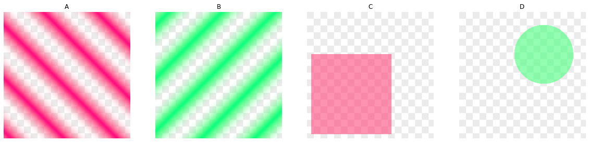
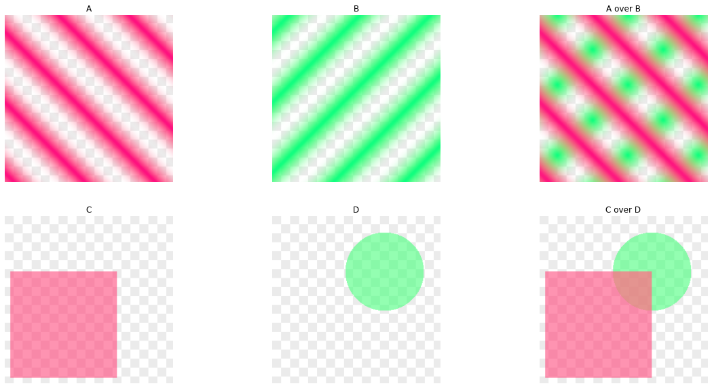
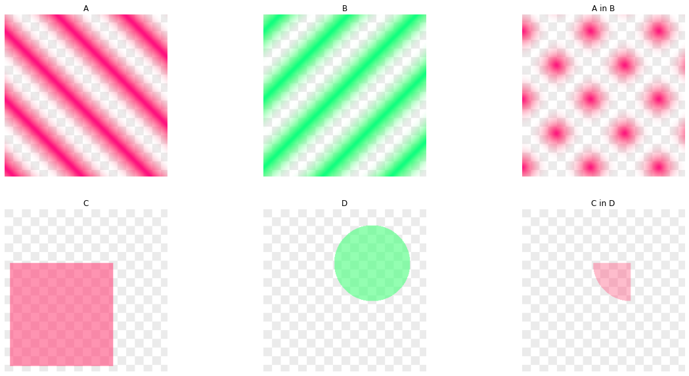
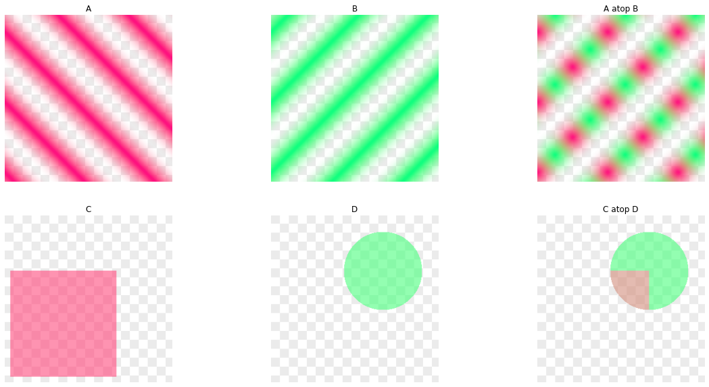
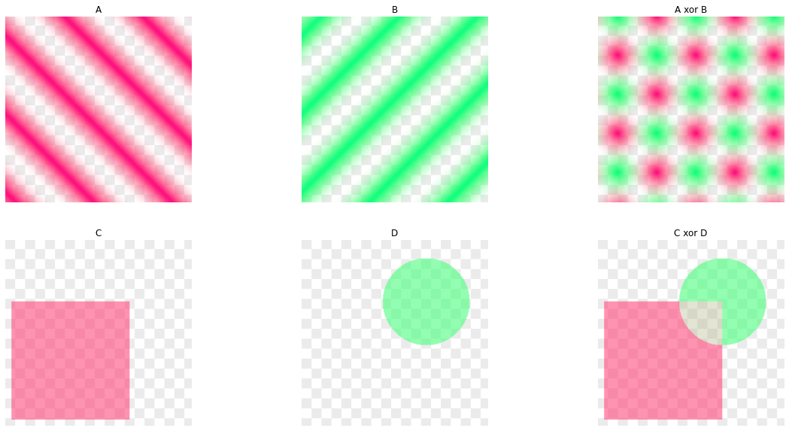
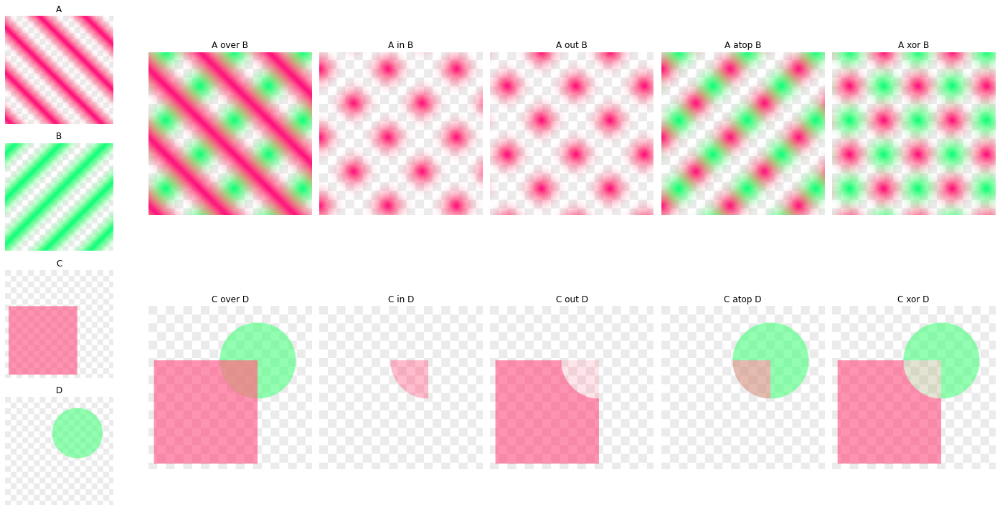
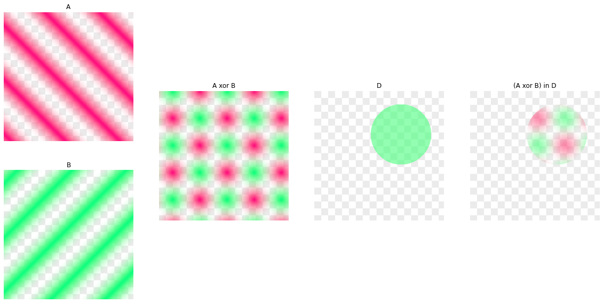
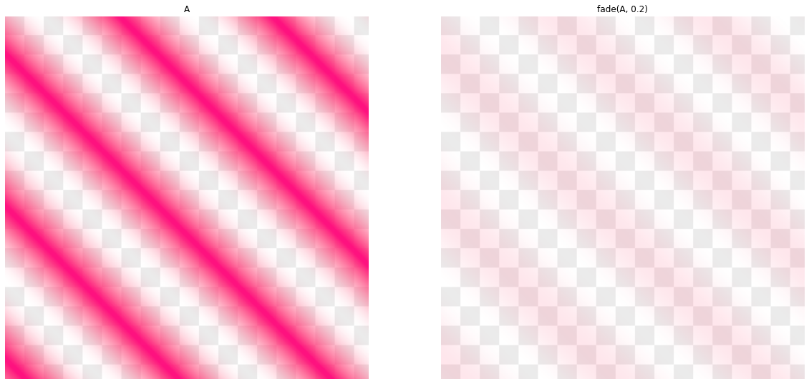
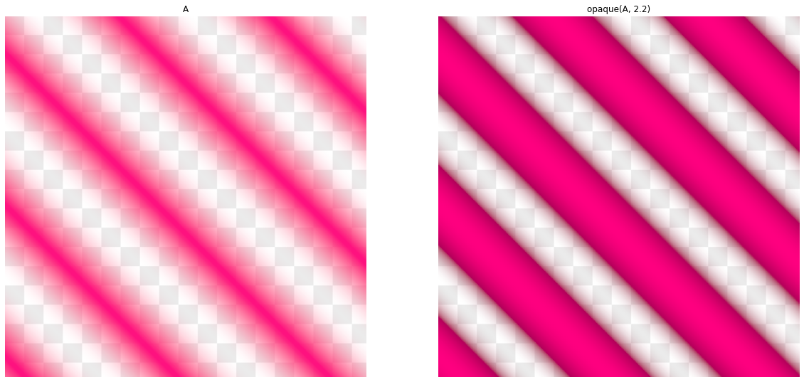
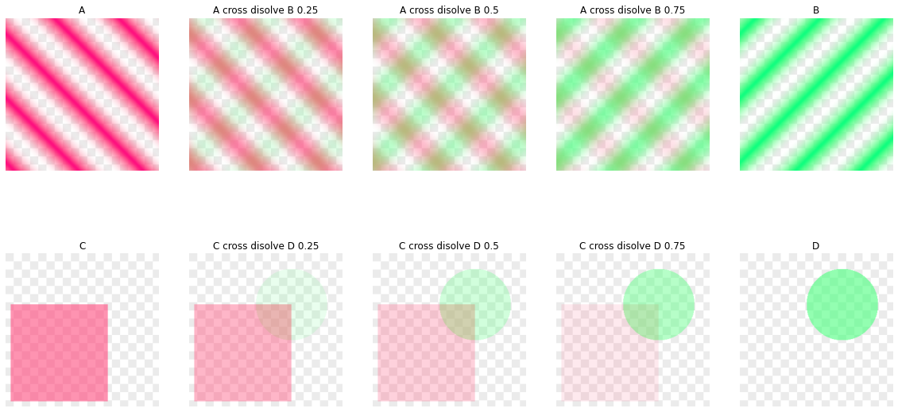

*Author: Alban Fichet <alban.fichet@gmx.fr>*  
*License: BSD 3-Clause License https://opensource.org/licenses/BSD-3-Clause*  
*Last modified: Nov. 1st 2021*  
*This code is for educational purpose, not meant to be efficient or clever.*

Alpha blending is an important concept in Computer Graphics. It is the foundation of compositing techniques: it allows to merge different images together. You're seeing it when you're adding layers in GIMP or Photoshop, when you’re making a cross dissolve between two videos or frames...

But there is much more effects and operations that can happen when compositing layers. Let's see some of it.


```python
import numpy as np
import matplotlib.pyplot as plt
import matplotlib.gridspec as gridspec
from PIL import Image
import os

plt.rcParams['figure.figsize'] = (20.0, 10.0)
plt.rcParams['figure.facecolor'] = 'white'

output_dir = 'output'

if not os.path.exists(output_dir):
    os.mkdir(output_dir)
```

## Note on gamma correction

We are manipulating 8 bit integer images in this notebook. So, a gamma correction is applied on color channels. **Take extra care with gamma correction. Every operation on color channel must be applied on linear color, not on gamma corrected colors.**

On the other hand, the alpha channel is stored linearly, between 0 and 255. It has to be rescaled to 0 to 1 but **no gamma correction is applied on alpha channel itself**.

This extra care that must be taken on alpha channel is repeated all along this notebook. That may seem pedantic but trust me, it is too easy to overlook and end up with messed up colors ;-). So, excuse the redundancy.

For the sake of simplicity, we use a gamma of 2.2:

$$
C_\text{gamma} = C_\text{linear}^{\frac{1}{2.2}}
$$

And in reverse:

$$
C_\text{linear} = C_\text{gamma}^{2.2}
$$

It is a good approximation of sRGB gamma but not the exact one. The exact sRGB gamma is:

$$
C_\text{sRGB} = \begin{cases}
12.92C_\text{linear}, & C_\text{linear} \le 0.0031308 \\[5mu]
1.055C_\text{linear}^{1/2.4}-0.055, & C_\text{linear} > 0.0031308
\end{cases}
$$

And in reverse:

$$
C_\mathrm{linear}=
\begin{cases}\dfrac{C_\mathrm{sRGB}}{12.92}, & C_\mathrm{sRGB}\le0.04045 \\[5mu]
\left(\dfrac{C_\mathrm{sRGB}+0.055}{1.055}\right)^{\!2.4}, & C_\mathrm{sRGB}>0.04045
\end{cases}
$$

see: https://en.wikipedia.org/wiki/SRGB


# Premultiplied vs. straight alpha

Two representations exist for images with an alpha channel:
- straight alpha: each color values remains at full intensity while alpha channel is used to modulate these channels: $[R, G, B, \alpha]$
- premultiplied alpha: each color values are stored multiplied with the alpha value: $[R \cdot \alpha, G \cdot \alpha, B \cdot \alpha, \alpha]$

To convert straight alpha to premultiplied alpha, you have to multiply the alpha channel to each color component. Note that if the color components are gamma corrected, the gamma correction must be inverted to get linear values and then reapplied. **Gamma correction is a recurring thing to keep in mind when operating on color channels!**


```python
def straight_to_premul(im):
    px = np.asarray(im)
    alpha = px[:, :, 3] / 255
        
    for i in range(3):
        px[:, :, i] = 255 * pow(pow(px[:, :, i] / 255, 2.2) * alpha, 1/2.2)
    
    return Image.fromarray(px.astype(np.uint8))
```

In reverse, to convert a premultiplied alpha image to a straight alpha image, the alpha channel must be divided. A special care must be taken in order to avoid division by 0.


```python
def premul_to_straight(im):
    px = np.asarray(im)
    alpha = px[:, :, 3] / 255
    
    # I'm sure there is a more pythonic way to do that...
    alpha = np.ravel(alpha)
    px_r = np.ravel(px[:, :, 0])
    px_g = np.ravel(px[:, :, 1])
    px_b = np.ravel(px[:, :, 2])
    
    px_r[alpha >= 1/255] = 255 * pow(pow(px_r[alpha >= 1/255] / 255, 2.2) / alpha[alpha >= 1/255], 1/2.2)
    px_g[alpha >= 1/255] = 255 * pow(pow(px_g[alpha >= 1/255] / 255, 2.2) / alpha[alpha >= 1/255], 1/2.2)
    px_b[alpha >= 1/255] = 255 * pow(pow(px_b[alpha >= 1/255] / 255, 2.2) / alpha[alpha >= 1/255], 1/2.2)
    
    px_r[alpha < 1/255] = 0    
    px_g[alpha < 1/255] = 0    
    px_b[alpha < 1/255] = 0    
    
    px_r.resize((im.height, im.width))
    px_g.resize((im.height, im.width))
    px_b.resize((im.height, im.width))

    px = np.stack((px_r, px_g, px_b, px[:, :, 3]), axis=-1) 
        
    return Image.fromarray(px.astype(np.uint8))
```

Using premultiplied alpha eases computations and is the convention used in this notebook. To ensure using the same formulation, we define a function to transform a premultiplied alpha image to a non-alpha image. Then, we're sure that matplotlib properly displays the image as intended. In this step we also add a checkerboard pattern in the background.

When you're dealing with an image containing an alpha channel, you have to know which representation is used before applying any alpha blending operation. The compositing formula depend on which representation is used.


```python
# Generates a checkerboard pattern, usefull for showing background on 
# transparent images
def gen_checkerboard(width, height, value, checker_size):
    checkerboard = np.ones((height, width, 3)) * 255

    cherckerboard_sz = 16

    for i in np.r_[:checkerboard.shape[0]:checker_size]:
        for j in np.r_[:checkerboard.shape[1]:checker_size]:
            if (i/checker_size + j/checker_size) % 2 == 0:
                checkerboard[i:i+checker_size, j:j+checker_size, :] = value

    return Image.fromarray(checkerboard.astype(np.uint8))


# To ensure we work with premultiplied alpha, converts the RGBA to RGB
def get_background_premul(im):
    background = np.asarray(gen_checkerboard(im.width, im.height, 235, 16))
    image      = np.asarray(im)
    
    px_out = np.zeros((im.height, im.width, 3))
    
    background_lin = pow(background / 255, 2.2)
    colors_in_lin  = pow(image[:, :, 0:3] / 255, 2.2)
    alpha_in       = image[:, :, 3] / 255
    
    for i in range(3):
        px_out[:, :, i] = np.clip(colors_in_lin[:, :, i] + (1 - alpha_in) * background_lin[:, :, i], 0, 1)
    
    # Apply gamma mapping back
    px_out[:, :, 0:3] = 255 * pow(px_out, 1/2.2)
    
    return Image.fromarray(px_out.astype(np.uint8))
```

# Create sample images

We create two groups of two images to show operators:
- one group with diagonal stripes of different color, A and B
- one group with two geometric shapes, C and D


```python
width, height = 300, 300

# Create first set, diagonal stripes
px_a = np.zeros((height, width, 4))
px_b = np.zeros((height, width, 4))

f = 0.1

for y in range(height):
    for x in range(width):
        alpha_a = (1 + np.sin(f * (y - x) / 2)) / 2.
        
        px_a[y, x, 3] = alpha_a * 255
        px_a[y, x, 0] = 255 * pow(alpha_a, 1/2.2)
        px_a[y, x, 1] = 0
        px_a[y, x, 2] = 128 * pow(alpha_a, 1/2.2)
        
        alpha_b = (1 + np.sin(f * (y + x) / 2)) / 2.

        px_b[y, x, 3] = alpha_b * 255
        px_b[y, x, 0] = 0
        px_b[y, x, 1] = 255 * pow(alpha_b, 1/2.2)
        px_b[y, x, 2] = 128 * pow(alpha_b, 1/2.2)

im_a = Image.fromarray(px_a.astype(np.uint8))
im_b = Image.fromarray(px_b.astype(np.uint8))


# Create second set, rectangle and circle

# Rectangle
px_c = np.zeros((height, width, 4))

alpha = 0.7

px_c[height//3:height-10, 10:width - width//3, 0] = 255 * pow(alpha, 1/2.2)
px_c[height//3:height-10, 10:width - width//3, 1] = 0
px_c[height//3:height-10, 10:width - width//3, 2] = 128 * pow(alpha, 1/2.2)
px_c[height//3:height-10, 10:width - width//3, 3] = 255 * alpha

im_c = Image.fromarray(px_c.astype(np.uint8))

# Circle
px_d = np.zeros((height, width, 4))

c = (width - width//3, height//3)
r = 70

for y in range(height):
    for x in range(width):
        dist = (x - c[0])**2 + (y - c[1])**2
        if np.sqrt(dist) < r:
            alpha = 0.7
        else:
            alpha = 0
        
        px_d[y, x, 0] = 0
        px_d[y, x, 1] = 255 * pow(alpha, 1/2.2)
        px_d[y, x, 2] = 128 * pow(alpha, 1/2.2)
        px_d[y, x, 3] = 255 * alpha

im_d = Image.fromarray(px_d.astype(np.uint8))

# Save everything
get_background_premul(im_a).save(os.path.join(output_dir, 'A.png'))
get_background_premul(im_b).save(os.path.join(output_dir, 'B.png'))
get_background_premul(im_c).save(os.path.join(output_dir, 'C.png'))
get_background_premul(im_d).save(os.path.join(output_dir, 'D.png'))
```


```python
plt.subplot(141)
plt.axis('off')
plt.title('A')
plt.imshow(get_background_premul(im_a))

plt.subplot(142)
plt.axis('off')
plt.title('B')
plt.imshow(get_background_premul(im_b))

plt.subplot(143)
plt.axis('off')
plt.title('C')
plt.imshow(get_background_premul(im_c))

plt.subplot(144)
plt.axis('off')
plt.title('D')
plt.imshow(get_background_premul(im_d))

plt.show()
```


    

    


# Two pixels operations

These operators work on two input images and compose them together.

## A over B operation

The operation A over B represents an operation where the image A covers the image B. This is probably the effect you want most of the time.

The resulting alpha channel is computed as follows:

$$
\alpha_{out} = \alpha_a + \alpha_b \cdot (1 - \alpha_a)
$$

And for premultiplied alpha, the color channels are computed as follows:

$$
C_{out} = C_a + C_b \cdot (1 - \alpha_a)
$$

**Be careful with gamma correction!** When the image is 8 bits / channel integer, it is more likely stored with gamma mapping. This has to be reversed prior to any operation on color channels:

$$
C_{out}' = \mathrm{gamma}\left(\mathrm{gamma}^{-1}(C_a) +  \mathrm{gamma}^{-1}(C_b) \cdot (1 - \alpha_a)\right)
$$


```python
def over_premul(im_a, im_b):
    px_a = np.asarray(im_a)
    px_b = np.asarray(im_b)
    
    px_c = np.zeros((im_a.height, im_a.width, 4))
    
    alpha_a = px_a[:, :, 3] / 255
    alpha_b = px_b[:, :, 3] / 255
    alpha_c = alpha_a + alpha_b * (1 - alpha_a)
    
    px_c[:, :, 3] = 255 * alpha_c
    
    for i in range(3):
        # Color channels must be linear to perform alpha compositing
        c_a_lin = pow(px_a[:, :, i]/255, 2.2) 
        c_b_lin = pow(px_b[:, :, i]/255, 2.2)
        
        # a_top_b premultiplied alpha
        c_out_lin = c_a_lin + c_b_lin * (1 - alpha_a)
        
        px_c[:, :, i] = 255 * pow(c_out_lin, 1/2.2)

    return Image.fromarray(px_c.astype(np.uint8))
```


```python
im_a_over_b = over_premul(im_a, im_b)
im_c_over_d = over_premul(im_c, im_d)

get_background_premul(im_a_over_b).save(os.path.join(output_dir, 'A_over_B.png'))
get_background_premul(im_c_over_d).save(os.path.join(output_dir, 'C_over_D.png'))
```


```python
plt.subplot(231)
plt.axis('off')
plt.title('A')
plt.imshow(get_background_premul(im_a))

plt.subplot(232)
plt.axis('off')
plt.title('B')
plt.imshow(get_background_premul(im_b))

plt.subplot(233)
plt.axis('off')
plt.title('A over B')
plt.imshow(get_background_premul(im_a_over_b))


plt.subplot(234)
plt.axis('off')
plt.title('C')
plt.imshow(get_background_premul(im_c))

plt.subplot(235)
plt.axis('off')
plt.title('D')
plt.imshow(get_background_premul(im_d))

plt.subplot(236)
plt.axis('off')
plt.title('C over D')
plt.imshow(get_background_premul(im_c_over_d))


plt.show()
```


    

    


We can define an operation with the coefficients $F_a$ and $F_b$ modulating color and alpha channels. For alpha channel, we get:

$$
\alpha_{out} = F_a \cdot \alpha_a + F_b \cdot \alpha_b
$$

and for linear color channels:

$$
C_{out} = F_a \cdot C_a + F_b \cdot C_b
$$

**Gamma mapping:** in case we're dealing with gamma corrected color channels, the gamma mapping must be reversed prior to the transformation on color channels applied back after the transformation:

$$
C'_{out} = \mathrm{gamma}\left(F_a \cdot \mathrm{gamma}^{-1}(C'_a) + F_b \cdot \mathrm{gamma}^{-1}(C'_b)\right)
$$

Gamma mapping is not applied to alpha channel itself. The transformation remains as:

$$
\alpha_{out} = F_a \cdot \alpha_a + F_b \cdot \alpha_b
$$


```python
def oper(im_a, im_b, f_a, f_b):
    px_a = np.asarray(im_a)
    px_b = np.asarray(im_b)
    
    px_c = np.zeros((im_a.height, im_a.width, 4))
    
    alpha_a = px_a[:, :, 3] / 255
    alpha_b = px_b[:, :, 3] / 255
    
    alpha_c = f_a * alpha_a + f_b * alpha_b
    
    px_c[:, :, 3] = alpha_c
    
    for i in range(3):
        # Color channels must be linear to perform alpha compositing
        c_a_lin = pow(px_a[:, :, i]/255, 2.2) 
        c_b_lin = pow(px_b[:, :, i]/255, 2.2)
        
        c_out_lin = f_a * c_a_lin + f_b * c_b_lin
        
        px_c[:, :, i] = pow(c_out_lin, 1/2.2)

    px_c = 255 * np.clip(px_c, 0, 1)
    
    return Image.fromarray(px_c.astype(np.uint8))
```

For A over B, $F_a$ and $F_b$ are defined as:

$$
\begin{align}
F_a &= 1 \\
F_b &= 1 - \alpha_a
\end{align}
$$


```python
def over_coefs(im_a, im_b):
    alpha_a = np.asarray(im_a)[:, :, 3]

    f_a = np.ones(alpha_a.shape)
    f_b = 1 - alpha_a/255

    return f_a, f_b


def over_premul(im_a, im_b):
    f_a, f_b = over_coefs(im_a, im_b)
    return oper(im_a, im_b, f_a, f_b)
```

## A in B operation

This operation takes the alpha channel of B and applies it to A:

$$
\begin{align}
F_a &= \alpha_b \\
F_b &= 0
\end{align}
$$


```python
def in_coefs(im_a, im_b):
    alpha_b = np.asarray(im_b)[:, :, 3]

    f_a = alpha_b/255
    f_b = np.zeros(alpha_b.shape)

    return f_a, f_b


def in_premul(im_a, im_b):
    f_a, f_b = in_coefs(im_a, im_b)
    return oper(im_a, im_b, f_a, f_b)
```


```python
im_a_in_b = in_premul(im_a, im_b)
im_c_in_d = in_premul(im_c, im_d)

get_background_premul(im_a_in_b).save(os.path.join(output_dir, 'A_in_B.png'))
get_background_premul(im_c_in_d).save(os.path.join(output_dir, 'C_in_D.png'))
```


```python
plt.subplot(231)
plt.axis('off')
plt.title('A')
plt.imshow(get_background_premul(im_a))

plt.subplot(232)
plt.axis('off')
plt.title('B')
plt.imshow(get_background_premul(im_b))

plt.subplot(233)
plt.axis('off')
plt.title('A in B')
plt.imshow(get_background_premul(im_a_in_b))


plt.subplot(234)
plt.axis('off')
plt.title('C')
plt.imshow(get_background_premul(im_c))

plt.subplot(235)
plt.axis('off')
plt.title('D')
plt.imshow(get_background_premul(im_d))

plt.subplot(236)
plt.axis('off')
plt.title('C in D')
plt.imshow(get_background_premul(im_c_in_d))


plt.show()
```


    

    


## A out B

This operation removes channels of B from A:

$$
\begin{align}
F_a &= 1-\alpha_b \\
F_b &= 0
\end{align}
$$


```python
def out_coefs(im_a, im_b):
    alpha_b = np.asarray(im_b)[:, :, 3]

    f_a = 1 - alpha_b/255
    f_b = np.zeros(alpha_b.shape)

    return f_a, f_b


def out_premul(im_a, im_b):
    f_a, f_b = out_coefs(im_a, im_b)
    return oper(im_a, im_b, f_a, f_b)
```


```python
im_a_out_b = out_premul(im_a, im_b)
im_c_out_d = out_premul(im_c, im_d)

get_background_premul(im_a_out_b).save(os.path.join(output_dir, 'A_out_B.png'))
get_background_premul(im_c_out_d).save(os.path.join(output_dir, 'C_out_D.png'))
```


```python
plt.subplot(231)
plt.axis('off')
plt.title('A')
plt.imshow(get_background_premul(im_a))

plt.subplot(232)
plt.axis('off')
plt.title('B')
plt.imshow(get_background_premul(im_b))


plt.subplot(233)
plt.axis('off')
plt.title('A out B')
plt.imshow(get_background_premul(im_a_out_b))

plt.subplot(234)
plt.axis('off')
plt.title('C')
plt.imshow(get_background_premul(im_c))

plt.subplot(235)
plt.axis('off')
plt.title('D')
plt.imshow(get_background_premul(im_d))

plt.subplot(236)
plt.axis('off')
plt.title('C out D')
plt.imshow(get_background_premul(im_c_out_d))


plt.show()
```


    

    


## A atop B

This operation mixes A with B where B is not transparent.

$$
\begin{align}
F_a &= \alpha_b \\
F_b &= (1 - \alpha_a)
\end{align}
$$


```python
def atop_coefs(im_a, im_b):
    alpha_a = np.asarray(im_a)[:, :, 3]
    alpha_b = np.asarray(im_b)[:, :, 3]

    f_a = alpha_b/255
    f_b = 1 - alpha_a/255

    return f_a, f_b


def atop_premul(im_a, im_b):
    f_a, f_b = atop_coefs(im_a, im_b)
    return oper(im_a, im_b, f_a, f_b)
```


```python
im_a_atop_b = atop_premul(im_a, im_b)
im_c_atop_d = atop_premul(im_c, im_d)

get_background_premul(im_a_atop_b).save(os.path.join(output_dir, 'A_atop_B.png'))
get_background_premul(im_c_atop_d).save(os.path.join(output_dir, 'C_atop_D.png'))
```


```python
plt.subplot(231)
plt.axis('off')
plt.title('A')
plt.imshow(get_background_premul(im_a))

plt.subplot(232)
plt.axis('off')
plt.title('B')
plt.imshow(get_background_premul(im_b))

plt.subplot(233)
plt.axis('off')
plt.title('A atop B')
plt.imshow(get_background_premul(im_a_atop_b))


plt.subplot(234)
plt.axis('off')
plt.title('C')
plt.imshow(get_background_premul(im_c))

plt.subplot(235)
plt.axis('off')
plt.title('D')
plt.imshow(get_background_premul(im_d))

plt.subplot(236)
plt.axis('off')
plt.title('C atop D')
plt.imshow(get_background_premul(im_c_atop_d))


plt.show()
```


    

    


## A xor B

This operation takes inverse of transparency on B for A and inverse of transparency of A on B.

$$
\begin{align}
F_a &= 1 - \alpha_b \\
F_b &= 1 - \alpha_a
\end{align}
$$


```python
def xor_coefs(im_a, im_b):
    alpha_a = np.asarray(im_a)[:, :, 3]
    alpha_b = np.asarray(im_b)[:, :, 3]

    f_a = 1 - alpha_b/255
    f_b = 1 - alpha_a/255

    return f_a, f_b


def xor_premul(im_a, im_b):
    f_a, f_b = xor_coefs(im_a, im_b)
    return oper(im_a, im_b, f_a, f_b)
```


```python
im_a_xor_b = xor_premul(im_a, im_b)
im_c_xor_d = xor_premul(im_c, im_d)

get_background_premul(im_a_xor_b).save(os.path.join(output_dir, 'A_xor_B.png'))
get_background_premul(im_c_xor_d).save(os.path.join(output_dir, 'C_xor_D.png'))
```


```python
plt.subplot(231)
plt.axis('off')
plt.title('A')
plt.imshow(get_background_premul(im_a))

plt.subplot(232)
plt.axis('off')
plt.title('B')
plt.imshow(get_background_premul(im_b))

plt.subplot(233)
plt.axis('off')
plt.title('A xor B')
plt.imshow(get_background_premul(im_a_xor_b))


plt.subplot(234)
plt.axis('off')
plt.title('C')
plt.imshow(get_background_premul(im_c))

plt.subplot(235)
plt.axis('off')
plt.title('D')
plt.imshow(get_background_premul(im_d))

plt.subplot(236)
plt.axis('off')
plt.title('C xor D')
plt.imshow(get_background_premul(im_c_xor_d))


plt.show()
```


    

    


## Summary

| Operator (a, b) | $F_a$          | $F_b$          |
|-----------------|----------------|----------------|
| A **over** B    | $1$            | $1 - \alpha_a$ |
| A **in** B      | $\alpha_b$     | $0$            |
| A **out** B     | $1-\alpha_b$   | $0$            |
| A **atop** B    | $\alpha_b$     | $1 - \alpha_a$ |
| A **xor** B     | $1 - \alpha_b$ | $1 - \alpha_a$ |

Resulting alpha channel:

$$
\alpha_{out} = F_a \cdot \alpha_a + F_b \cdot \alpha_b
$$

Resulting linear color channels:

$$
C_{out} = F_a \cdot C_a + F_b \cdot C_b
$$

**Gamma mapping:** in case we're dealing with gamma corrected color channels, the gamma mapping must be reversed prior to the transformation on color channels applied back after the transformation:

$$
C'_{out} = \mathrm{gamma}\left(F_a \cdot \mathrm{gamma}^{-1}(C'_a) + F_b \cdot \mathrm{gamma}^{-1}(C'_b)\right)
$$


```python
fig = plt.figure(1)

gridspec.GridSpec(4,6)

# Show starting images A & B

plt.subplot2grid((4,6), (0,0))
plt.axis('off')
plt.title('A')
plt.imshow(get_background_premul(im_a))

plt.subplot2grid((4,6), (1,0))
plt.axis('off')
plt.title('B')
plt.imshow(get_background_premul(im_b))

# Show operations for A & B

plt.subplot2grid((4,6), (0,1), colspan=1, rowspan=2)
plt.axis('off')
plt.title('A over B')
plt.imshow(get_background_premul(im_a_over_b))

plt.subplot2grid((4,6), (0,2), colspan=1, rowspan=2)
plt.axis('off')
plt.title('A in B')
plt.imshow(get_background_premul(im_a_in_b))

plt.subplot2grid((4,6), (0,3), colspan=1, rowspan=2)
plt.axis('off')
plt.title('A out B')
plt.imshow(get_background_premul(im_a_out_b))

plt.subplot2grid((4,6), (0,4), colspan=1, rowspan=2)
plt.axis('off')
plt.title('A atop B')
plt.imshow(get_background_premul(im_a_atop_b))

plt.subplot2grid((4,6), (0,5), colspan=1, rowspan=2)
plt.axis('off')
plt.title('A xor B')
plt.imshow(get_background_premul(im_a_xor_b))


# Show starting images C & D

plt.subplot2grid((4,6), (2,0))
plt.axis('off')
plt.title('C')
plt.imshow(get_background_premul(im_c))

plt.subplot2grid((4,6), (3,0))
plt.axis('off')
plt.title('D')
plt.imshow(get_background_premul(im_d))

# Show operations for C & D

plt.subplot2grid((4,6), (2,1), colspan=1, rowspan=2)
plt.axis('off')
plt.title('C over D')
plt.imshow(get_background_premul(im_c_over_d))

plt.subplot2grid((4,6), (2,2), colspan=1, rowspan=2)
plt.axis('off')
plt.title('C in D')
plt.imshow(get_background_premul(im_c_in_d))

plt.subplot2grid((4,6), (2,3), colspan=1, rowspan=2)
plt.axis('off')
plt.title('C out D')
plt.imshow(get_background_premul(im_c_out_d))

plt.subplot2grid((4,6), (2,4), colspan=1, rowspan=2)
plt.axis('off')
plt.title('C atop D')
plt.imshow(get_background_premul(im_c_atop_d))

plt.subplot2grid((4,6), (2,5), colspan=1, rowspan=2)
plt.axis('off')
plt.title('C xor D')
plt.imshow(get_background_premul(im_c_xor_d))


fig.tight_layout()
plt.show()
```


    

    


## Combining operations


```python
im_a_xor_b = xor_premul(im_a, im_b)

im_compo = in_premul(im_a_xor_b, im_d)
```


```python
fig = plt.figure(1)

gridspec.GridSpec(2,4)

# Show starting images A & B

plt.subplot2grid((2,4), (0,0))
plt.axis('off')
plt.title('A')
plt.imshow(get_background_premul(im_a))

plt.subplot2grid((2,4), (1,0))
plt.axis('off')
plt.title('B')
plt.imshow(get_background_premul(im_b))

# 1st step
plt.subplot2grid((2,4), (0,1), colspan=1, rowspan=2)
plt.axis('off')
plt.title('A xor B')
plt.imshow(get_background_premul(im_a_xor_b))

plt.subplot2grid((2,4), (0,2), colspan=1, rowspan=2)
plt.axis('off')
plt.title('D')
plt.imshow(get_background_premul(im_d))

# 2nd step
plt.subplot2grid((2,4), (0,3), colspan=1, rowspan=2)
plt.axis('off')
plt.title('(A xor B) in D')
plt.imshow(get_background_premul(im_compo))

plt.show()
```


    

    


# One pixel operation

The following operations works on a single image.

## Darken

Darken acts on color values while remaining the alpha channel untouched: $[\rho R, \rho G, \rho B, \alpha]$ with $\rho \in [0:1]$. **Again, do the transformation on linear color values, take extra care with gamma corrected images!**


```python
def darken(im, coef):
    px = np.asarray(im)
    
    c_lin = pow(px[:, :, 0:3]/255, 2.2)
    
    px[:, :, 0:3] = pow(np.clip(c_lin * coef, 0, 1), 1/2.2) * 255
    
    return Image.fromarray(px.astype(np.uint8))
```


```python
im_a_darken = darken(im_a, 0.2)

get_background_premul(im_a_darken).save(os.path.join(output_dir, 'A_darken.png'))
```


```python
plt.subplot(1, 2, 1)
plt.axis('off')
plt.title('A')
plt.imshow(get_background_premul(im_a))

plt.subplot(1, 2, 2)
plt.axis('off')
plt.title('darken(A, 0.2)')
plt.imshow(get_background_premul(darken(im_a, .2)))

plt.show()
```


    

    


## Fade

Fade multiply both color values and alpha channel: $[\delta R, \delta G, \delta B, \delta \alpha]$ with $\delta \in [0:1]$. **Again, do the transformation on linear color values, take extra care with gamma corrected images!**


```python
def fade(im, coef):
    px = np.asarray(im)
    
    c_lin = pow(px[:, :, 0:3]/255, 2.2)
    
    px[:, :, 0:3] = pow(np.clip(c_lin * coef, 0, 1), 1/2.2) * 255
    px[:, :, 3] = coef * px[:, :, 3]
    
    return Image.fromarray(px.astype(np.uint8))
```


```python
im_a_fade = fade(im_a, .2)

get_background_premul(im_a_fade).save(os.path.join(output_dir, 'A_fade.png'))
```


```python
plt.subplot(1, 2, 1)
plt.axis('off')
plt.title('A')
plt.imshow(get_background_premul(im_a))

plt.subplot(1, 2, 2)
plt.axis('off')
plt.title('fade(A, 0.2)')
plt.imshow(get_background_premul(fade(im_a, .2)))

plt.show()
```


    

    


## Opaque

Opaque modifies the alpha channel: $[R, G, B, \omega \alpha]$.


```python
def opaque(im, coef):
    px = np.asarray(im)
        
    px[:, :, 3] = np.clip(coef * px[:, :, 3]/255, 0, 1) * 255
    
    return Image.fromarray(px.astype(np.uint8))
```


```python
im_a_opaque = opaque(im_a, 2.2)

get_background_premul(im_a_opaque).save(os.path.join(output_dir, 'A_opaque.png'))
```


```python
plt.subplot(1, 2, 1)
plt.axis('off')
plt.title('A')
plt.imshow(get_background_premul(im_a))

plt.subplot(1, 2, 2)
plt.axis('off')
plt.title('opaque(A, 2.2)')
plt.imshow(get_background_premul(opaque(im_a, 2.2)))

plt.show()
```


    

    


# Combining different operations

## Cross dissolve

### A plus B

This operator adds all channels of A and B. It is not necessarily useful by itself, you probably want to handle alpha separately but used combined with fade to cross dissolve two images (see below).

$$
\begin{align}
F_a &= 1 \\
F_b &= 1
\end{align}
$$

### Combining operators

Progressive transition between A and B:
$$
C = \mathrm{fade}(A, t) + \mathrm{fade}(B, 1 - t)
$$

**Again, do the transformation on linear color values, take extra care with gamma corrected images!**


```python
def plus_coefs(im_a, im_b):
    f_a = np.ones((im_a.height, im_a.width))
    f_b = np.ones((im_b.height, im_b.width))

    return f_a, f_b


def plus_premul(im_a, im_b):
    f_a, f_b = plus_coefs(im_a, im_b)
    return oper(im_a, im_b, f_a, f_b)


def cross_disolve_premul(im_a, im_b, t):
    im_a_f = fade(im_a, t)
    im_b_f = fade(im_b, 1 - t)
    
    return plus_premul(im_a_f, im_b_f)
```


```python
plt.subplot(2, 5, 1)
plt.axis('off')
plt.title('A')
plt.imshow(get_background_premul(im_a))

plt.subplot(2, 5, 2)
plt.axis('off')
plt.title('A cross disolve B 0.25')
plt.imshow(get_background_premul(cross_disolve_premul(im_a, im_b, 0.75)))

plt.subplot(2, 5, 3)
plt.axis('off')
plt.title('A cross disolve B 0.5')
plt.imshow(get_background_premul(cross_disolve_premul(im_a, im_b, 0.5)))


plt.subplot(2, 5, 4)
plt.axis('off')
plt.title('A cross disolve B 0.75')
plt.imshow(get_background_premul(cross_disolve_premul(im_a, im_b, 0.25)))

plt.subplot(2, 5, 5)
plt.axis('off')
plt.title('B')
plt.imshow(get_background_premul(im_b))


plt.subplot(2, 5, 6)
plt.axis('off')
plt.title('C')
plt.imshow(get_background_premul(im_c))

plt.subplot(2, 5, 7)
plt.axis('off')
plt.title('C cross disolve D 0.25')
plt.imshow(get_background_premul(cross_disolve_premul(im_c, im_d, 0.75)))

plt.subplot(2, 5, 8)
plt.axis('off')
plt.title('C cross disolve D 0.5')
plt.imshow(get_background_premul(cross_disolve_premul(im_c, im_d, 0.5)))

plt.subplot(2, 5, 9)
plt.axis('off')
plt.title('C cross disolve D 0.75')
plt.imshow(get_background_premul(cross_disolve_premul(im_c, im_d, 0.25)))

plt.subplot(2, 5, 10)
plt.axis('off')
plt.title('D')
plt.imshow(get_background_premul(im_d))


plt.show()
```


    

    

