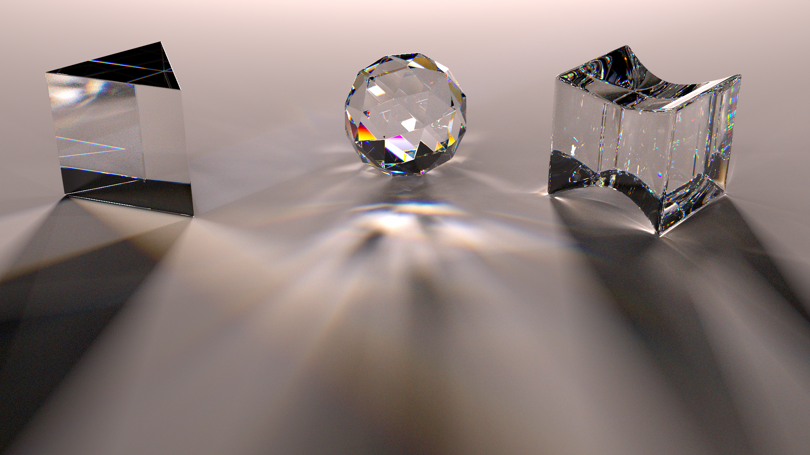
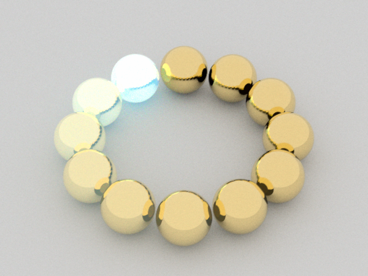

  

    
This is my academic website.

    
I am a postdoctoral researcher at Charles University in Prague, Czech Republic working with <a href="https://cgg.mff.cuni.cz/~wilkie/Website/Home.html">Alexander Wilkie.</a>

    
I was previously a postdoctoral researcher at Institut d'Optique Graduate School in Bordeaux, France working with <a href="http://manao.inria.fr/perso/~pac/research.php">Romain Pacanowski</a>.

    
I defended my PhD on December 2019. I was under the supervision of <a href="https://artis.inria.fr/Members/Nicolas.Holzschuch/">Nicolas Holzschuch</a>. The subject of my PhD is efficient representation for measured reflectance. You can access my manuscript here: <a href="https://tel.archives-ouvertes.fr/tel-02893514">https://tel.archives-ouvertes.fr/tel-02893514</a>.

    
I did a year exchange in Czech Republic at Charles University in <a href="http://cgg.mff.cuni.cz/">Computer Graphics Group</a> under the supervision of <a href="http://cgg.mff.cuni.cz/~wilkie">Alexander Wilkie</a> and <a href="http://cgg.mff.cuni.cz/~jaroslav">Jaroslav Křivánek</a>.

  

  

    

      <header class="w3-container">
        <h2>Contact</h2>
      </header>
      

	    
email: <a href="mailto:alban.fichet@inria.fr">alban.fichet@gmx.fr</a>

	    
<a href="https://keys.openpgp.org/vks/v1/by-fingerprint/683606E773C3AF5AD048D5D0704935AF5FA927F9">PGP Key: 6836 06E7 73C3 AF5A D048 D5D0 7049 35AF 5FA9 27F9</a>

      

    

  

# Shadertoy

  

    

      
    

  

  

    

      
    

  

  

    

      
    

  

  

    <a href="shadertoy" class="w3-button w3-blue">More...</a>
  

 

# Publications

## 2021

<!-- Efficient Spectral Rendering on the GPU for Predictive Rendering -->

  

    
  

  

    

      
<a href="https://hal.inria.fr/hal-03331619">
        Efficient Spectral Rendering on the GPU for Predictive Rendering
      </a>

    

    

      
David Murray, Alban Fichet, Romain Pacanowski

    

    

      

      Current graphic processing units (GPU) in conjunction with specialized APIs
      open the possibility of interactive path tracing. Spectral rendering is
      necessary for accurate and predictive light transport simulation, especially to
      render specific phenomena such as light dispersion. However, it requires
      larger assets than traditional RGB rendering pipelines. Thanks to the
      increase of available onboard memory on newer graphic cards, it becomes
      possible to load larger assets onto the GPU, making spectral rendering
      feasible. In this chapter, we describe the strengths of spectral rendering and
      present our approach for implementing a spectral path tracer on the GPU. We
      also propose solutions to limit the impact on memory when handling finely
      sampled spectra or large scenes.
      

    

    

      <a href="https://doi.org/10.1007/978-1-4842-7185-8">Ray Tracing Gems II, Apress, Berkeley, CA 2021 - Chapter 42 pp.673 - 698 &lt;10.1007/978-1-4842-7185-8&gt; </a>
    

  

<!-- A Compact Representation for Fluorescent Spectral Data -->

  

      
  

  

    

      
<a href="https://hal.archives-ouvertes.fr/hal-03274233">
        A Compact Representation for Fluorescent Spectral Data
      </a>

    

    

      
Qingqin Hua, Alban Fichet, Alexander Wilkie

    

    

      

      We propose a technique to efficiently importance sample and
      store fluorescent spectral data. Fluorescence behaviour is
      properly represented as a re-radiation matrix: for a given
      input wavelength, this matrix indicates how much energy is
      re-emitted at all other wavelengths. However, such a 2D
      representation has a significant memory footprint,
      especially when a scene contains a high number of
      fluorescent objects or fluorescent textures. We propose to
      use Gaussian Mixture Domain to model re-radiation, which
      allows us to significantly reduce the memory
      footprint. Instead of storing the full matrix, we work with
      a set of Gaussian parameters that also allow direct
      importance sampling. When accuracy is a concern, one can
      still use the re-radiation matrix data, and just benefit
      from importance sampling provided by the Gaussian
      Mixture. Our method is useful when numerous fluorescent
      materials are present in a scene, and in particular for
      textures with fluorescent components.
      

    

    

      <a href="https://egsr.eu/2021">Eurographics Symposium on Rendering (EGSR) &lt;10.2312/sr.20211305&gt; </a>
    

  

<!-- An OpenEXR Layout for Spectral Images -->

  

    
  

  

    

      
<a href="https://hal.inria.fr/hal-03252797">
        An OpenEXR Layout for Spectral Images
      </a>

    

    

      
Alban Fichet, Romain Pacanowski, Alexander Wilkie

    

    

      

      We propose a standardised layout to organise spectral data
      stored in OpenEXR images. We motivate why we chose the
      OpenEXR format as basis for our work, and we explain our
      choices with regard to data selection and organisation:
      our goal is to define a standard for the exchange of
      measured or simulated spectral and bi-spectral data. We
      also provide sample code to store spectral images in
      OpenEXR format.
      

    

    

      <a href="http://jcgt.org">Journal of Computer Graphics Techniques</a>
    

  

## 2018

<!-- Handling Fluorescence in a Uni-directional Spectral Path Tracer -->

  

    
  

  

    

      
<a href="https://hal.inria.fr/hal-01818826">
        Handling Fluorescence in a Uni-directional Spectral Path Tracer
      </a>

    

    

      
Michal Mojzík, Alban Fichet, Alexander Wilkie

    

    

      

      We present two separate improvements to the handling of
      fluorescence effects in modern uni-directional spectral rendering
      systems. The first is the formulation of a new distance tracking
      scheme for fluorescent volume materials which exhibit a pronounced
      wavelength asymmetry. Such volumetric materials are an important and
      not uncommon corner case of wavelength-shifting media behaviour, and
      have not been addressed so far in rendering literature. The second
      one is that we introduce an extension of Hero wavelength sampling
      which can handle fluorescence events, both on surfaces, and in
      volumes. Both improvements are useful by themselves, and can be used
      separately: when used together, they enable the robust inclusion of
      arbitrary fluorescence effects in modern uni-directional spectral
      MIS path tracers. Our extension of Hero wavelength sampling is
      generally useful, while our proposed technique for distance tracking
      in strongly asymmetric media is admittedly not very efficient.
      However, it makes the most of a rather difficult situation, and at
      least allows the inclusion of such media in uni-directional path
      tracers, albeit at comparatively high cost. Which is still an
      improvement since up to now, their inclusion was not really possible
      at all, due to the inability of conventional tracking schemes to
      generate sampling points in such volume materials.
      

    

    

      <a href="https://dx.doi.org/10.1111/cgf.13477">Computer Graphics Forum, Wiley, 2018, 37 (4), pp.77 - 94. &lt;10.1111/cgf.13477&gt;</a>
    

  

## 2016

<!-- Capturing Spatially Varying Anisotropic Reflectance Parameters using Fourier Analysis -->

  

    
  

  

    

      
<a href="https://hal.inria.fr/hal-01302120v2">
        Capturing Spatially Varying Anisotropic Reflectance Parameters using Fourier Analysis
      </a>

    

    

      
Alban Fichet, Imari Sato, Nicolas Holzschuch

    

    

      

      Reflectance parameters condition the appearance of objects in photorealistic rendering. Practical acquisition of reflectance parameters is still a difficult problem. Even more so for spatially varying or anisotropic materials, which increase the number of samples required. In this paper, we present an algorithm for acquisition of spatially varying anisotropic materials, sampling only a small number of directions. Our algorithm uses Fourier analysis to extract the material parameters from a sub-sampled signal. We are able to extract diffuse and specular reflectance, direction of anisotropy, surface normal and reflectance parameters from as little as 20 sample directions. Our system makes no assumption about the stationarity or regularity of the materials, and can recover anisotropic effects at the pixel level.
      

    

    

      <a href="https://dx.doi.org/10.20380/GI2016.09">Graphics Interface Conference 2016, Jun 2016, Victoria, BC, Canada. pp.65-73, &lt;10.20380/GI2016.09&gt;</a>
    

  

